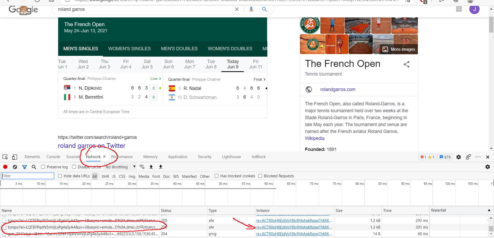
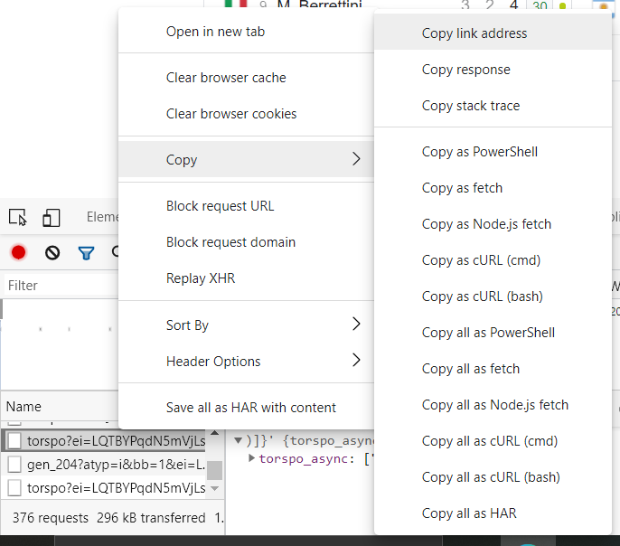

`RolandGarros.py` is a script giving the score of a live Roland Garros match using google data

To use it, you can type the google request "roland garros" in your browser and it will display you the current matchs.

Then you can get the right URL in your browser console. To open the console, press `Ctrl`+`CAPS`+`c` and got in the 'Network' tab.
Double click as show bellow, it will open a new window to download a text file. You don't have to download it, but copy the URL of the page and thanks to it, you will be able to see the match live score in your terminal
 
In some browser, it will download automatically the .txt file, so to get the url, you can try to copy the link differently, like for me in edge:
 
